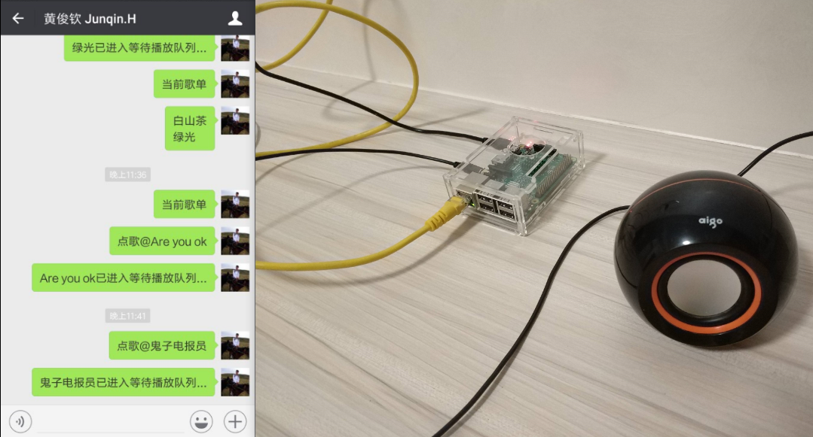

# musicBox
一个简单的基于树莓派&amp;微信的musicBox，蛮有意思的，音源来自网易云、QQ、虾米、酷我、酷狗、咪咕。

### reliance
- [Itchat](https://github.com/littlecodersh/ItChat): 微信网页版API
```bash
pip install itchat
```
- mpg123: mp3音频解码
```bash
sudo apt-get install mpg123
```
- baidu-aip: 百度语音合成
```bash
pip install baidu-aip
```

### commands
- 点歌@<歌名> [<歌手>]
- 当前歌单
- 下一首

> 可以自行设置更多指令

### snapshot

