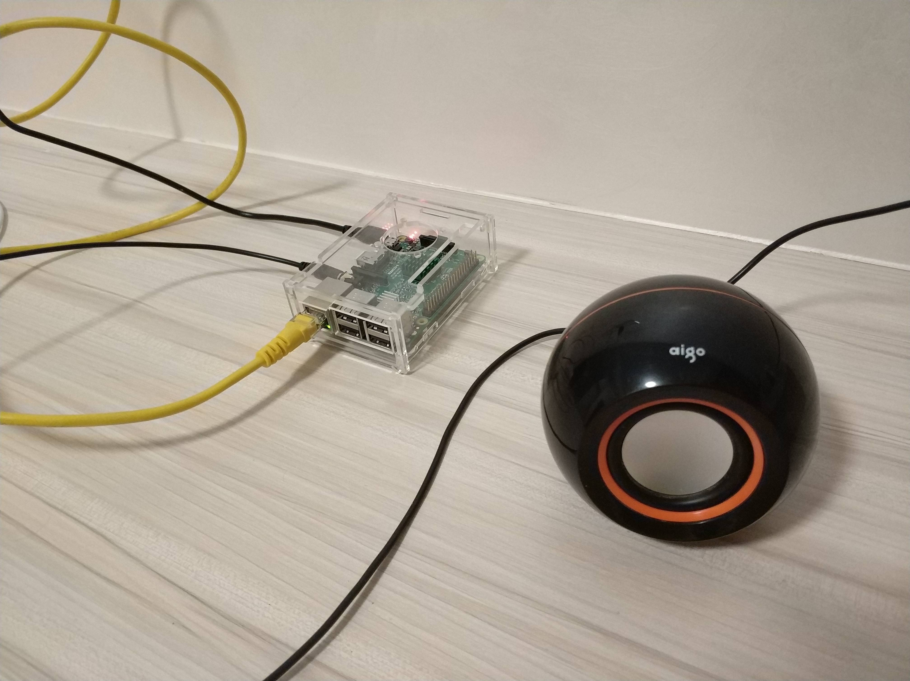
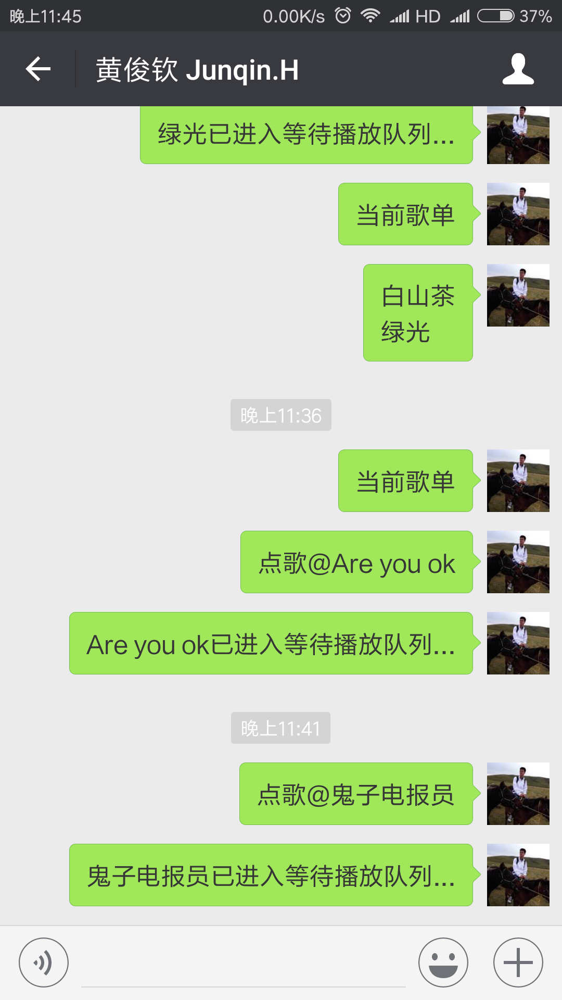

# musicBox
一个简单的基于树莓派&amp;微信的musicBox，蛮有意思的

### reliance
- [Itchat](https://github.com/littlecodersh/ItChat): 微信网页版API
```bash
pip install itchat
```
- mpg123: mp3音频解码
```bash
sudo apt-get install mpg123
```

### snapshot


